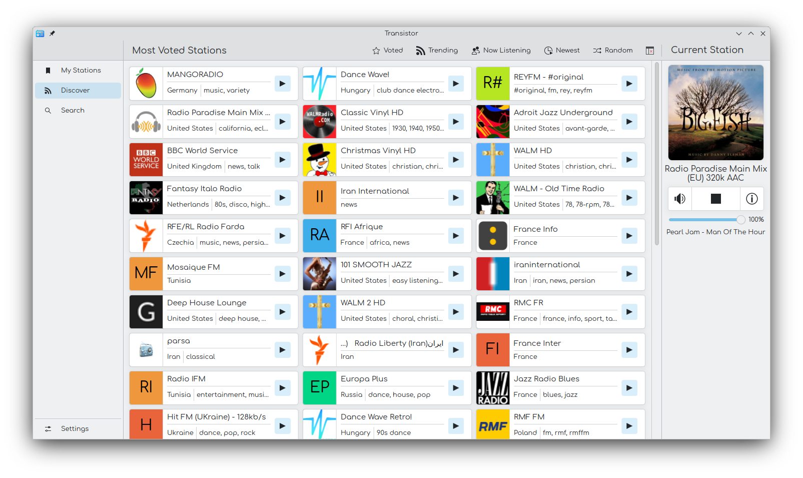

# Transistor

Internet radio player that provides access to a station database with over 50,000 stations.

## Features

* Create your own library where you can add your favorite stations
* Easily search and discover new radio stations
* Automatic recognition of tracks if is possible
* Responsive application layout, compatible for small and large screens

## Installation

```bash
mkdir build
cd build
cmake -DCMAKE_INSTALL_PREFIX=/usr -DCMAKE_BUILD_TYPE=Release -GNinja ..
ninja
sudo ninja install
```

## License

This project is licensed under GPL-3.0-or-later.

## Project Website

[transistor-radio.ru](https://transistor-radio.ru)

